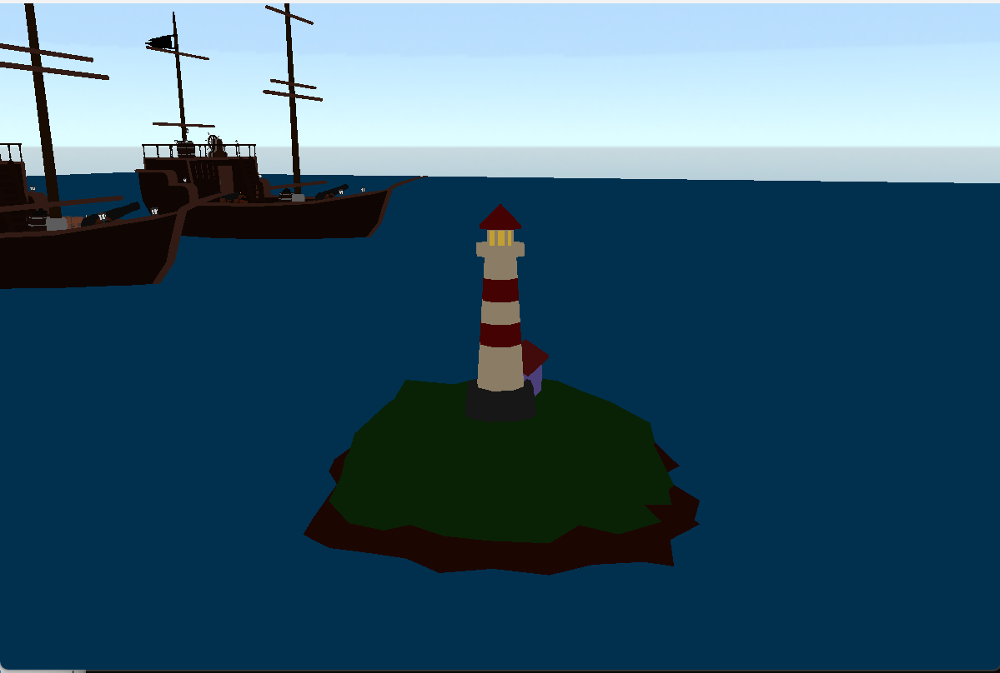
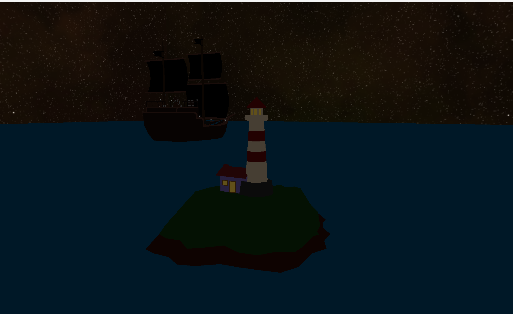
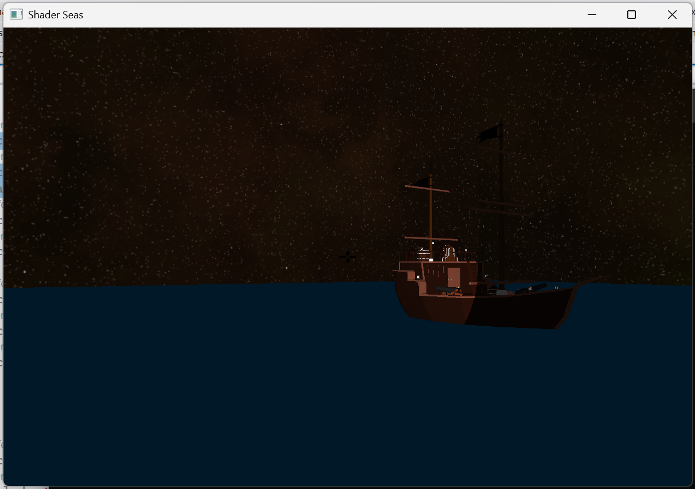
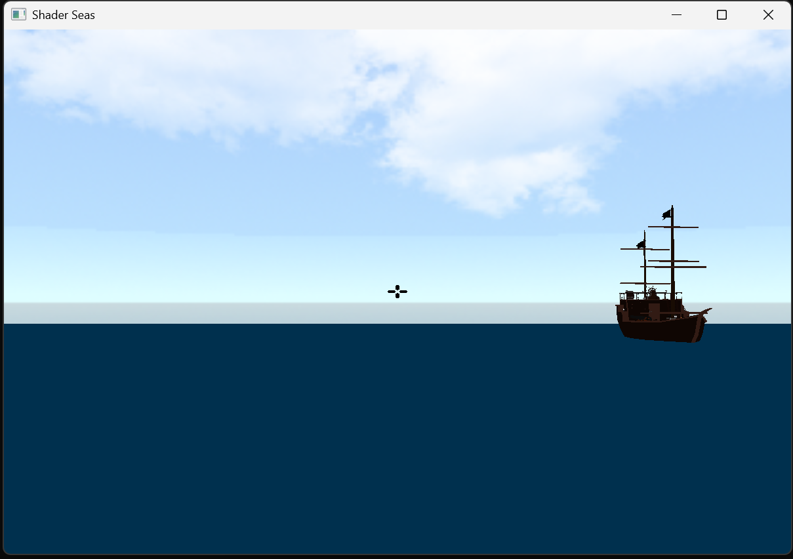

# ShadersSea

Autores: Xabier Novoa Gomez, Adrian Quiroga Linares

ShadersSea es una escena 3D interactiva hecha con OpenGL. La idea del proyecto es simple: un faro situado en una isla debe defender la zona de oleadas de barcos enemigos. Cada vez que se elimina una oleada completa, la siguiente aparece con un barco mas, asi que la dificultad va creciendo de forma progresiva.

## Contenido del proyecto

El proyecto incluye:

- un skybox con cambio entre ambiente diurno y nocturno
- iluminacion dinamica asociada al faro
- generacion de oleadas de barcos
- disparo de proyectiles con deteccion de colisiones
- modo de disparo con cruceta y modo de camara libre
- carga de modelos `.obj` mediante `TinyObjLoader`

La musica de fondo se activa tras la primera oleada superada. Esa parte usa la API de audio de Windows, asi que en otros sistemas puede no estar disponible.

## Compilacion

El repositorio incluye un `Makefile`, asi que la compilacion se hace directamente con `make`.

Requisitos minimos:

- `g++` con soporte para C++17
- `GLFW3`
- OpenGL
- `pkg-config`

Comandos:

```bash
make
make run
make clean
```

## Controles

- `W`: avanzar
- `S`: retroceder
- `A`: girar a la izquierda
- `D`: girar a la derecha
- `Espacio`: disparar
- `N`: cambiar el modo de iluminacion
- `1`: modo de disparo con cruceta
- `2`: modo de camara libre

## Capturas






## Referencias

- [OpenGL Documentation](https://www.opengl.org/documentation/)
- [TinyObjLoader](https://github.com/tinyobjloader/tinyobjloader)
- [LearnOpenGL](https://learnopengl.com/)
- Documentacion de la API de audio de Windows
